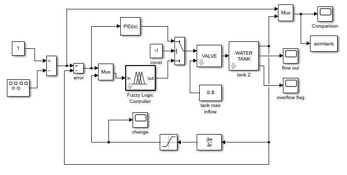
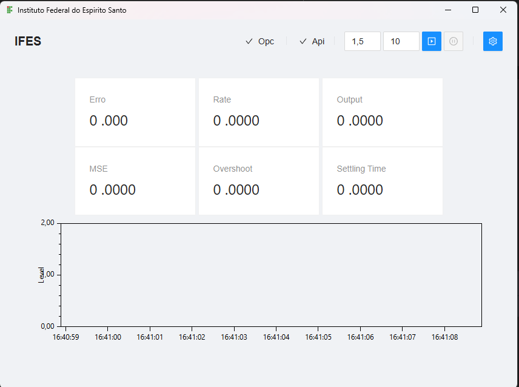
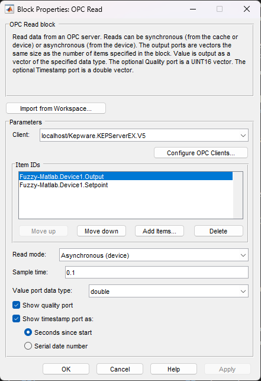
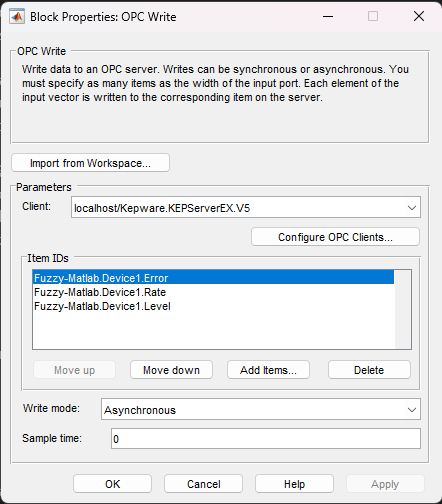
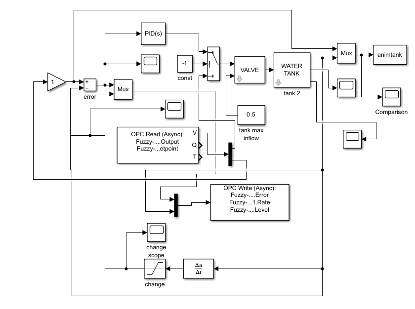
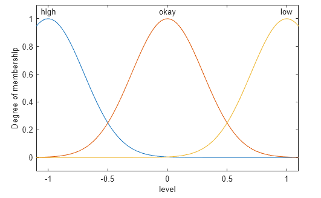
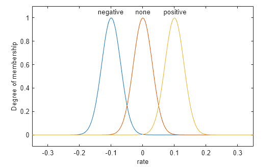
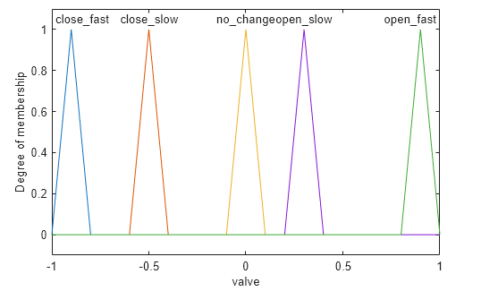
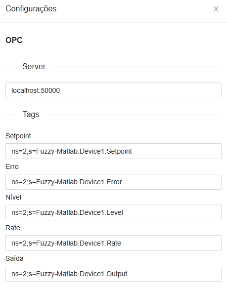

# Supervisão e controle de nível com lógica Fuzzy: Uma integração baseada em OPC

## Resumo

No âmbito da automação industrial, a integração entre sistemas de controle constitui uma necessidade fundamental para o monitoramento e controle eficiente de processos produtivos. Este trabalho apresenta o desenvolvimento de um sistema de supervisão e controle de nível baseado em lógica Fuzzy, integrado através do protocolo OPC (Open Platform Communications).

A lógica Fuzzy, técnica de inteligência artificial que possibilita o tratamento de incertezas e imprecisões inerentes aos processos industriais, demonstra particular adequação para o controle de plantas de nível. Tais sistemas, amplamente utilizados nas indústrias petroquímica, farmacêutica e de alimentos e bebidas, caracterizam-se por sua natureza não linear e frequentemente multivariável, apresentando desafios significativos para técnicas de controle convencionais.

O objetivo principal deste trabalho consiste na implementação de uma arquitetura de integração entre uma API responsável pelo controle Fuzzy e uma planta de nível simulada, utilizando o protocolo OPC como meio de comunicação. Esta abordagem visa demonstrar a viabilidade da aplicação de técnicas de inteligência artificial em ambientes industriais reais, aproveitando-se da padronização e ampla adoção do protocolo OPC na indústria moderna.

## Lista de Figuras

**Figura 1** - Arquitetura do sistema de controle de nível com lógica Fuzzy integrado via OPC UA

**Figura 2** - Planta de nível de água em tanque do Matlab/Simulink (modelo sltank)

**Figura 3** - Interface Humano-Máquina desenvolvida em C# para supervisão e controle

**Figura 4** - Configuração do bloco OPC Read para leitura de tags do servidor OPC

**Figura 5** - Configuração do bloco OPC Write para escrita de tags no servidor OPC

**Figura 6** - Planta de nível modificada com integração OPC UA para comunicação externa

**Figura 7** - Funções de pertinência gaussianas da variável de entrada "level" (erro de nível)

**Figura 8** - Funções de pertinência gaussianas da variável de entrada "rate" (taxa de variação)

**Figura 9** - Funções de pertinência triangulares da variável de saída "valve" (sinal de controle)

**Figura 10** - Interface Humano-Máquina integrada com cliente OPC UA para supervisão e controle

**Figura 11** - Configuração do cliente OPC UA na interface da IHM

**Figura 12** - Configuração do endpoint da API de controle Fuzzy

**Figura 13** - Interface de simulação integrada para testes do sistema de controle

**Figura 14** - Monitoramento do status de conexão com servidor OPC UA e API

## Lista de Tabelas

**Tabela 1** - Mapeamento de variáveis de processo para tags OPC UA

## Lista de Símbolos

**σ** - Desvio padrão (sigma) das funções de pertinência gaussianas

**μ** - Valor médio (mu) das funções de pertinência gaussianas

## 1. Introdução

A quarta revolução industrial, denominada Indústria 4.0, representa um paradigma transformador na manufatura global, caracterizada pela integração sistemática de tecnologias digitais avançadas nos processos produtivos. Este movimento revolucionário fundamenta-se na conectividade entre sistemas físicos e digitais, proporcionando maior eficiência, flexibilidade e sustentabilidade aos processos industriais (SCHWAB, 2016). Neste contexto, a automação industrial emerge como elemento central, demandando investimentos significativos em tecnologias que possibilitem a otimização de processos e a redução de custos operacionais.

Os investimentos em tecnologia para automatização têm experimentado crescimento exponencial nas últimas décadas, impulsionados pela necessidade de competitividade global e pela busca por processos mais eficientes e sustentáveis. Segundo dados da Associação Brasileira de Automação Industrial (ABAI), o mercado brasileiro de automação industrial registrou crescimento consistente, evidenciando a importância estratégica deste setor para o desenvolvimento econômico nacional. Tais investimentos abrangem desde a modernização de equipamentos até a implementação de sistemas de controle avançados, visando à otimização de recursos e ao aumento da produtividade.

A utilização de inteligência artificial na indústria constitui uma das principais tendências da Indústria 4.0, oferecendo soluções inovadoras para desafios complexos de controle e otimização. Técnicas como redes neurais, algoritmos genéticos e lógica Fuzzy têm demonstrado eficácia significativa na resolução de problemas industriais que envolvem incertezas, não linearidades e múltiplas variáveis. A lógica Fuzzy, em particular, destaca-se pela sua capacidade de modelar conhecimento humano especializado e tratar informações imprecisas, características comuns em ambientes industriais reais.

O controle automático representa um dos pilares fundamentais da automação industrial moderna, possibilitando a manutenção de variáveis de processo dentro de faixas operacionais desejadas sem intervenção humana direta. A implementação de sistemas de controle automático resulta em benefícios tangíveis, incluindo maior precisão no controle de processos, redução de variabilidade na qualidade do produto, diminuição de custos operacionais e melhoria nas condições de segurança operacional. Ademais, tais sistemas contribuem para a redução do impacto ambiental através da otimização do uso de recursos naturais e energia.

No contexto específico da automação industrial, o controle de nível assume importância crítica em diversas aplicações, desde o armazenamento de matérias-primas até o processamento final de produtos. Sistemas de controle de nível são essenciais para garantir a continuidade operacional, prevenir perdas de produto por transbordamento, evitar danos a equipamentos por operação em vazio e assegurar a qualidade do produto final. Nas indústrias petroquímica, farmacêutica e de alimentos e bebidas, o controle preciso de nível em tanques e reatores é fundamental para manter as condições ideais de processo e atender aos rigorosos padrões de qualidade e segurança exigidos por essas indústrias.

Diante deste cenário, o presente trabalho propõe uma abordagem para o controle de nível industrial, integrando a lógica Fuzzy com o protocolo OPC, visando demonstrar a viabilidade da aplicação de técnicas de inteligência artificial em ambientes industriais reais através de uma arquitetura de integração padronizada e amplamente adotada pela indústria.

### 1.1 Revisão bibliográfica

#### 1.1.1 Importância do controle de nível

O controle de nível em processos industriais constitui uma das variáveis mais críticas para o funcionamento seguro e eficiente de plantas produtivas. A relevância deste tipo de controle é evidenciada em diversos setores industriais, desde aplicações didáticas até implementações em larga escala industrial.

**BACOVIS (2016)** realizaram um estudo comparativo entre controladores Fuzzy e PID aplicados em uma planta didática de nível de líquido, demonstrando que o controle adequado de nível é fundamental para o aprendizado e compreensão dos princípios de automação industrial. O trabalho evidencia que plantas de nível são amplamente utilizadas em ambientes educacionais devido à sua capacidade de representar fielmente os desafios encontrados em processos industriais reais, incluindo não linearidades, tempo morto e distúrbios externos.

Na indústria de alimentos e bebidas, **Gomes (2022)** investigou a aplicação da lógica Fuzzy no controle de qualidade na produção de cerveja, onde o controle preciso de nível em tanques de fermentação e maturação é crucial para garantir a qualidade do produto final. O autor demonstra que variações não controladas no nível podem afetar diretamente características organolépticas da cerveja, como aroma, sabor e teor alcoólico, evidenciando a importância crítica do controle de nível em processos biotecnológicos.

Em aplicações de saneamento e abastecimento público, **SILVEIRA et al. (2021)** apresentaram um estudo sobre a aplicação da lógica Fuzzy no controle de nível de reservatório de abastecimento de água, destacando que o controle eficiente de nível é essencial para garantir o fornecimento contínuo e adequado de água potável. Os autores enfatizam que falhas em sistemas de controle de nível podem resultar em desabastecimento populacional, desperdício de recursos hídricos e comprometimento da qualidade da água distribuída.

A importância do controle de nível transcende aspectos puramente técnicos, envolvendo questões econômicas, ambientais e de segurança. Sistemas de controle de nível inadequados podem resultar em perdas significativas de produto, consumo excessivo de energia, riscos ambientais por vazamentos e comprometimento da segurança operacional. Ademais, o controle preciso de nível é fundamental para otimizar o uso de recursos naturais e contribuir para a sustentabilidade de processos industriais.

#### 1.1.2 Utilização do OPC em plantas industriais

O protocolo OPC (Open Platform Communications) e sua evolução para OPC UA (Unified Architecture) têm revolucionado a comunicação industrial, oferecendo soluções padronizadas para a integração de sistemas heterogêneos em ambientes produtivos. A aplicação desta tecnologia em plantas industriais demonstra sua versatilidade e eficácia na resolução de desafios complexos de interoperabilidade e digitalização.

**Carvalho et al. (2023)** investigaram a digitalização de uma planta industrial utilizando o protocolo de comunicação OPC-UA, focando no sistema educacional CP Lab da Festo. O estudo demonstra como a Indústria 4.0 está impulsionando transformações profundas na indústria através de soluções que aprimoram a produção e elevam a qualidade dos produtos. Os autores evidenciam que tecnologias como IoT, sistemas ciberfísicos, Big Data e computação em nuvem estão remodelando as operações empresariais através da integração de sistemas, criação de fábricas inteligentes e melhoria da eficiência. A pesquisa destaca que a utilização do protocolo OPC UA para conectar módulos ciberfísicos e dispositivos à nuvem possibilita análise de dados em tempo real para identificar status atual, problemas potenciais e tomar decisões mais eficazes.

Em aplicações de manufatura flexível, **Silva (2023)** desenvolveu um sistema de instrumentação para uma planta de manufatura flexível utilizando o padrão OPC-UA embarcado no microcontrolador ESP32. O trabalho evidencia que o OPC-UA é um padrão de comunicação industrial que permite transferência de dados segura e confiável entre diferentes sistemas e dispositivos em setores industriais. O estudo demonstra a viabilidade de implementar servidores OPC-UA em dispositivos embarcados de baixo custo, estabelecendo comunicação entre servidores OPC-UA utilizando a ferramenta Node-RED para transferir dados do sistema de medição para controladores lógicos programáveis (CLP) presentes na planta industrial.

**Petrocchi (2024)** apresentou uma implementação da integração entre tecnologia RFID e o padrão OPC UA aplicada a um sistema de manufatura flexível no laboratório da UNESP campus Sorocaba. O trabalho demonstra que o padrão OPC UA fornece uma troca segura de informações e dados na área da automação industrial, utilizando um protocolo padrão extensível que pode ser empregado em multiplataformas. A pesquisa evidencia que é possível realizar alterações das informações através do sistema de servidor e cliente graças às funcionalidades de acesso aos dados do OPC UA. O desenvolvimento utilizou o ambiente Node-RED para configuração automática do leitor RFID e criação do servidor OPC UA, permitindo leitura e escrita de dados tanto pelo servidor quanto pela interface gráfica.

**Souza (2024)** conduziu um estudo de caso sobre controle e supervisão de processos utilizando o padrão OPC, focando na superação dos desafios de integração entre equipamentos e softwares de diferentes fabricantes devido a protocolos proprietários. O trabalho utilizou o CLP Codesys e o ambiente simulado do Factory IO, com foco na planta industrial Sorting Station, demonstrando como o padrão OPC UA promove a troca de dados e comandos entre sistemas distintos. A pesquisa explora as possibilidades tecnológicas oferecidas por essa integração, evidenciando a capacidade do OPC UA em conectar e comunicar softwares e dispositivos de diferentes fabricantes.

A utilização do OPC em plantas industriais transcende aspectos puramente técnicos, representando um facilitador fundamental para a implementação da Indústria 4.0. Os trabalhos analisados demonstram que a adoção do protocolo OPC UA resulta em maior flexibilidade operacional, redução de custos de integração, melhoria na interoperabilidade entre sistemas e facilita a migração para arquiteturas mais modernas. Ademais, a capacidade do OPC UA de operar em dispositivos embarcados de baixo custo democratiza o acesso a tecnologias avançadas de comunicação industrial, possibilitando a modernização de plantas existentes com investimentos reduzidos.

#### 1.1.3 Controle inteligente e OPC em aplicações industriais

A convergência entre técnicas de controle inteligente e protocolos de comunicação padronizados como o OPC representa uma das principais tendências na automação industrial moderna. Esta integração possibilita o desenvolvimento de sistemas de controle mais sofisticados, flexíveis e adaptáveis às demandas crescentes da Indústria 4.0, oferecendo soluções inovadoras para desafios complexos de controle e manutenção industrial.

**Oliveira Junior (2023)** desenvolveu um estudo sobre gerenciamento de nível em reservatório de líquidos utilizando lógica Fuzzy e controle PID, implementando uma arquitetura integrada baseada em OPC para comunicação entre sistemas. O trabalho apresenta um sistema amplamente utilizado nas instalações industriais: o controle de nível de tanque, realizado através do software CodeSys e Matlab/Simulink, com simulação no ambiente Factory I/O. A pesquisa desenvolveu dois controladores distintos: um baseado em lógica Fuzzy e outro em controle PID, utilizando o protocolo de comunicação OPC para estabelecer a comunicação entre o CLP, Matlab e Factory I/O. O autor evidencia que a utilização da ferramenta Fuzzy Logic Designer do Matlab, em conjunto com o Simulink, proporcionou análise detalhada do comportamento do sistema, demonstrando controle satisfatório do sistema simulado de tanque. Esta abordagem integrada ilustra como a combinação de técnicas de controle inteligente com protocolos de comunicação padronizados pode resultar em sistemas de controle mais eficazes e facilmente integráveis a arquiteturas industriais existentes.

**Coretti (2025)** investigou a automação com redes inteligentes para manutenção de sistemas de controle de processos industriais, focando no desenvolvimento de mecanismos para digitalização da malha de controle de vazão e tomada de decisão para análise da manutenção de sistemas automatizados. O trabalho utiliza conceitos da Indústria 4.0 e algoritmos de inteligência artificial para melhorar a visibilidade das malhas de controle fechadas e dos ativos da fábrica. A pesquisa propõe uma abordagem que facilita à equipe industrial de manutenção e operação maior facilidade na gestão dos sistemas de automação e tomada de decisões precisas, sem grandes interrupções do processo produtivo. O autor demonstra que a implementação de redes industriais inteligentes, combinada com manutenção proativa e softwares industriais, permite gestão mais eficiente das fábricas com custos reduzidos. A proposta inclui interface de digitalização da malha de controle livre, configurada em blocos funcionais na web, evidenciando a tendência de integração entre sistemas de automação tradicionais e plataformas digitais modernas.

A integração entre controle inteligente e OPC em aplicações industriais representa uma evolução natural dos sistemas de automação, proporcionando benefícios significativos em termos de flexibilidade, manutenibilidade e capacidade de integração. Os trabalhos analisados demonstram que esta abordagem permite não apenas melhor desempenho de controle através de técnicas inteligentes como lógica Fuzzy, mas também facilita a implementação de estratégias de manutenção preditiva e proativa através da padronização de comunicação proporcionada pelo OPC.

Ademais, a utilização de protocolos OPC em sistemas de controle inteligente contribui para a democratização do acesso a tecnologias avançadas, permitindo que empresas de diferentes portes implementem soluções sofisticadas de automação sem dependência de fornecedores específicos. Esta característica é fundamental para a competitividade industrial no contexto da Indústria 4.0, onde a capacidade de adaptação rápida às mudanças tecnológicas e de mercado constitui vantagem estratégica crítica.

### 1.2 Objetivos

Os objetivos deste trabalho podem ser definidos da seguinte forma:

#### 1.2.1 Objetivo geral

O objetivo geral deste trabalho consiste no desenvolvimento e implementação de uma arquitetura integrada de controle de nível industrial baseada em lógica Fuzzy, utilizando o protocolo OPC como meio de comunicação padronizado. Especificamente, pretende-se desenvolver uma API especializada para realizar o controle Fuzzy de sistemas de nível, integrá-la a uma planta de nível simulada através do protocolo OPC, e demonstrar o desempenho desta integração em termos de eficácia de controle, estabilidade do sistema e viabilidade de implementação em ambientes industriais reais.

Esta abordagem visa contribuir para o avanço do conhecimento na área de automação industrial inteligente, demonstrando a aplicabilidade prática da combinação entre técnicas de inteligência artificial e protocolos de comunicação padronizados na solução de problemas complexos de controle de processos industriais.

#### 1.2.2 Objetivos específicos

Para alcançar o objetivo geral proposto, foram definidos os seguintes objetivos específicos:

- **Caracterização do sistema de controle**: Extrair os parâmetros Fuzzy da planta de nível, identificando e definindo as variáveis de entrada e saída do sistema, bem como suas respectivas funções de pertinência e regras de inferência necessárias para o controle eficaz do processo.

- **Desenvolvimento da API de controle**: Desenvolver uma API especializada utilizando a linguagem Python, implementando os algoritmos de lógica Fuzzy baseados nos parâmetros previamente definidos, garantindo flexibilidade, robustez e facilidade de integração com sistemas externos.

- **Implementação da aplicação de integração**: Desenvolver uma aplicação utilizando a linguagem C# para promover a integração entre a API de controle Fuzzy e a planta de nível, implementando os protocolos de comunicação OPC necessários para estabelecer a troca de dados em tempo real entre os sistemas.

- **Desenvolvimento da interface humano-máquina**: Criar uma IHM (Interface Humano-Máquina) intuitiva e funcional que permita a configuração dinâmica da API e do cliente OPC, bem como a visualização em tempo real do controle de nível, proporcionando monitoramento eficiente e facilidade de operação do sistema integrado.

- **Análise de desempenho**: Analisar os resultados obtidos através de testes e simulações, avaliando parâmetros como estabilidade do controle, tempo de resposta, precisão no seguimento de referência, robustez a distúrbios e eficácia da comunicação OPC, documentando as conclusões e contribuições do trabalho para a área de automação industrial.

### 1.3 Estrutura do texto

Este trabalho está organizado em seis capítulos, estruturados de forma a apresentar uma sequência lógica e progressiva do desenvolvimento da pesquisa, desde a fundamentação teórica até a análise dos resultados obtidos.

**Capítulo 1 - Introdução**: Apresenta o contexto geral da pesquisa, abordando a importância do controle de nível em plantas industriais, a utilização do protocolo OPC em ambientes produtivos e a convergência entre controle inteligente e comunicação OPC. Este capítulo também define os objetivos do trabalho e estabelece a justificativa para a integração de técnicas de lógica Fuzzy com protocolos de comunicação padronizados.

**Capítulo 2 - Fundamentação Teórica**: Explora a evolução histórica dos sistemas de controle, desde as técnicas clássicas até as abordagens modernas, destacando onde o controle Fuzzy se posiciona nesta evolução tecnológica. Adicionalmente, examina a utilização de protocolos de comunicação em plantas industriais, enfatizando a importância da padronização e interoperabilidade para a Indústria 4.0.

**Capítulo 3 - Metodologia**: Detalha a metodologia empregada no desenvolvimento do trabalho, incluindo a justificativa para a escolha da planta de nível como objeto de estudo, a seleção da tecnologia Python para criação da API de controle Fuzzy, e a definição da tecnologia para desenvolvimento da Interface Humano-Máquina (IHM), fundamentando cada decisão tecnológica com base em critérios técnicos e práticos.

**Capítulo 4 - Desenvolvimento**: Apresenta o processo de desenvolvimento dos componentes principais do sistema integrado, incluindo a implementação da API de controle Fuzzy, o desenvolvimento da IHM para monitoramento e configuração, e a criação do cliente OPC UA para estabelecer a comunicação entre os diferentes módulos do sistema.

**Capítulo 5 - Resultados e Discussão**: Analisa os resultados obtidos através da integração entre a API de controle Fuzzy e a planta de nível via protocolo OPC, apresentando métricas de desempenho, estabilidade do sistema e eficácia da comunicação, bem como a discussão crítica dos resultados em relação aos objetivos propostos.

**Capítulo 6 - Conclusões e Trabalhos Futuros**: Sintetiza as principais conclusões do trabalho, destacando as contribuições para a área de automação industrial e controle inteligente, além de propor direcionamentos para trabalhos futuros que possam ampliar e aprofundar os resultados obtidos nesta pesquisa.

## 2. Fundamentação Teórica

A evolução dos sistemas de controle automático reflete o desenvolvimento tecnológico da humanidade, desde os primeiros mecanismos de realimentação até os modernos sistemas baseados em inteligência artificial. Os primórdios do controle automático remontam aos reguladores mecânicos do século XVIII, como o regulador centrífugo de James Watt para máquinas a vapor, estabelecendo os fundamentos do controle por realimentação. A formalização matemática destes conceitos ocorreu no século XX, com o desenvolvimento da teoria de controle clássico, caracterizada pela utilização de técnicas baseadas em função de transferência e análise no domínio da frequência (OGATA, 2010).

O controlador PID (Proporcional-Integral-Derivativo) emergiu como a solução mais amplamente adotada no controle clássico, oferecendo simplicidade de implementação e eficácia em uma ampla gama de aplicações industriais. Sua popularidade deve-se à capacidade de fornecer controle estável e responsivo através do ajuste de três parâmetros fundamentais: ganho proporcional, tempo integral e tempo derivativo (VILLAÇA; SILVEIRA, 2013).

A década de 1960 marcou o início da era do controle moderno, caracterizada pela representação de sistemas em espaço de estados e pela utilização de métodos de otimização. Esta abordagem permitiu o tratamento de sistemas multivariáveis e não lineares de forma mais sistemática, superando limitações do controle clássico. O controle moderno introduziu conceitos como controlabilidade, observabilidade e estabilidade no sentido de Lyapunov, com técnicas como o regulador linear quadrático (LQR) e o filtro de Kalman proporcionando ferramentas poderosas para o projeto de controladores ótimos (FRANKLIN et al., 2015).

O reconhecimento de que os modelos matemáticos são sempre aproximações da realidade levou ao desenvolvimento do controle robusto nas décadas de 1980 e 1990. Esta abordagem considera explicitamente as incertezas do modelo, garantindo estabilidade e desempenho satisfatório mesmo na presença de variações paramétricas e distúrbios não modelados. Técnicas como H∞ e μ-síntese forneceram métodos sistemáticos para o projeto de controladores robustos (ZHOU et al., 1996).

A lógica Fuzzy, introduzida por Lotfi Zadeh em 1965, representa uma abordagem fundamentalmente diferente para o controle de sistemas, baseada na capacidade humana de raciocinar com informações imprecisas e tomar decisões em ambientes de incerteza. Esta técnica emerge como uma ponte entre o controle convencional e a inteligência artificial aplicada, posicionando-se como uma alternativa às limitações dos métodos clássicos e modernos (ZADEH, 1965).

O desenvolvimento do controle Fuzzy surge em resposta às dificuldades encontradas pelos métodos convencionais em lidar com sistemas complexos, não lineares e mal definidos matematicamente. Enquanto o controle clássico e moderno dependem de modelos matemáticos precisos, o controle Fuzzy permite a incorporação de conhecimento heurístico e experiência operacional diretamente no algoritmo de controle, dispensando a necessidade de modelagem matemática rigorosa (MAMDANI; ASSILIAN, 1975).

O controle Fuzzy posiciona-se na evolução dos sistemas de controle como uma abordagem complementar que preenche lacunas deixadas pelos métodos convencionais. Sua principal contribuição reside na capacidade de tratar incertezas e imprecisões de forma natural, oferecendo robustez e simplicidade de implementação em aplicações onde modelos matemáticos precisos são difíceis de obter ou onde existe conhecimento heurístico valioso disponível (ROSS, 2010).

A integração eficiente de sistemas em ambientes industriais depende fundamentalmente da capacidade de comunicação entre dispositivos heterogêneos. A evolução dos protocolos de comunicação industrial reflete a crescente necessidade de interoperabilidade, segurança e eficiência na troca de informações. A comunicação industrial evoluiu de sistemas proprietários isolados para padrões abertos e interoperáveis, onde inicialmente cada fabricante desenvolvia seus próprios protocolos, resultando em "ilhas de automação" com limitada capacidade de integração (STENERSON; FIXED, 2015).

A necessidade de interoperabilidade levou ao desenvolvimento de padrões como Modbus, Profibus e DeviceNet. O OPC (Open Platform Communications) foi desenvolvido para resolver problemas de interoperabilidade em automação industrial, estabelecendo um padrão para comunicação entre aplicações de diferentes fornecedores. Baseado inicialmente na tecnologia DCOM da Microsoft, o OPC Classic proporcionou avanços significativos, mas suas limitações, incluindo dependência de plataforma e problemas de segurança, levaram ao desenvolvimento do OPC UA (Unified Architecture) (MAHNKE et al., 2009).

**Carvalho et al. (2023)** investigaram a digitalização de uma planta industrial utilizando o protocolo de comunicação OPC-UA, demonstrando como a Indústria 4.0 está impulsionando transformações profundas na indústria através de soluções que aprimoram a produção. A pesquisa destaca que a utilização do protocolo OPC UA para conectar módulos ciberfísicos e dispositivos à nuvem possibilita análise de dados em tempo real para identificar status atual, problemas potenciais e tomar decisões mais eficazes.

**Souza (2024)** conduziu um estudo de caso sobre controle e supervisão de processos utilizando o padrão OPC, focando na superação dos desafios de integração entre equipamentos e softwares de diferentes fabricantes devido a protocolos proprietários. O trabalho utilizou o CLP Codesys e o ambiente simulado do Factory IO, demonstrando como o padrão OPC UA promove a troca de dados e comandos entre sistemas distintos.

O OPC UA representa uma arquitetura completamente nova, projetada para ser independente de plataforma, segura, escalável e orientada a serviços. Utiliza uma arquitetura em camadas que separa a lógica de aplicação dos detalhes de comunicação, com modelo de informação baseado em uma estrutura hierárquica de nós e referências que permite representar informações complexas de forma padronizada e extensível (LEITNER; MAHNKE, 2006).

A utilização de protocolos de comunicação padronizados em plantas industriais transcende aspectos puramente técnicos, representando um facilitador fundamental para a implementação da Indústria 4.0. O OPC UA alinha-se perfeitamente com os princípios da Indústria 4.0, facilitando a integração de sistemas ciberfísicos, permitindo comunicação entre sistemas heterogêneos, suportando diversos paradigmas de comunicação e adaptando-se desde dispositivos de campo até sistemas na nuvem (JASPERNEITE, 2012).

A combinação de protocolos padronizados como OPC UA com técnicas de controle inteligente, incluindo lógica Fuzzy, oferece oportunidades únicas para a criação de sistemas de automação mais eficientes e adaptáveis. Esta integração permite distribuição de inteligência em diferentes níveis da hierarquia de controle, flexibilidade arquitetural onde mudanças nos algoritmos de controle não afetam a infraestrutura de comunicação, reutilização de componentes e manutenibilidade através da separação clara entre lógica de controle e comunicação.

**Oliveira Junior (2023)** desenvolveu um estudo sobre gerenciamento de nível em reservatório de líquidos utilizando lógica Fuzzy e controle PID, implementando uma arquitetura integrada baseada em OPC para comunicação entre sistemas. O trabalho demonstrou controle satisfatório do sistema simulado de tanque, ilustrando como a combinação de técnicas de controle inteligente com protocolos de comunicação padronizados pode resultar em sistemas de controle mais eficazes e facilmente integráveis.

A convergência entre controle inteligente e comunicação padronizada representa um paradigma fundamental para a automação industrial moderna, proporcionando a base tecnológica necessária para implementar os conceitos da Indústria 4.0 de forma eficaz e sustentável. Esta integração facilita a implementação de estratégias de manutenção preditiva e proativa, contribui para a democratização do acesso a tecnologias avançadas e permite que empresas de diferentes portes implementem soluções sofisticadas de automação sem dependência de fornecedores específicos.

## 3. Metodologia

A arquitetura proposta na figura abaixo fundamenta-se na integração de quatro componentes principais organizados de forma modular para proporcionar uma solução completa para controle de nível industrial distribuída.

<div align="center">


Figura 1 - Arquitetura do sistema de controle de nível com lógica Fuzzy integrado via OPC UA<br>
Fonte: Elaborado pelo autor (2025)

</div>

**Planta de nível simulada (Matlab/Simulink)**: Elemento central do sistema representando o processo industrial a ser controlado. Desenvolvida no ambiente Matlab/Simulink.

**API REST de controle Fuzzy**: Núcleo inteligente responsável pela implementação dos algoritmos de controle baseados em lógica Fuzzy.

**Cliente OPC UA integrado com IHM**: Componente intermediário que estabelece comunicação segura via protocolo OPC UA. Responsável pela leitura periódica das variáveis de processo, consumo da API de controle Fuzzy através de requisições HTTP e escrita dos sinais de controle. Integra uma IHM intuitiva para visualização em tempo real, monitoramento, configuração e intervenção manual.

**Servidor OPC**: Ponte de comunicação que expõe as variáveis da planta simulada no espaço de endereçamento OPC. Disponibiliza variáveis garantindo interoperabilidade, segurança e escalabilidade.

### 3.1 Escolha da planta de nível

Para o presente trabalho foi selecionada a planta de nível de água em tanque disponível como exemplo no conjunto de bibliotecas do Matlab, especificamente o modelo `sltank`. Esta escolha justifica-se pelo fato de que a proposta do trabalho é o desenvolvimento da integração entre sistemas e não a parametrização de uma nova planta de nível, além de permitir validação com uma referência estabelecida na literatura técnica.

O sistema de controle de nível de água em tanque apresenta características não lineares típicas de processos industriais reais. O controle é realizado através de uma válvula que regula o fluxo de entrada de água no tanque, enquanto a vazão de saída depende do diâmetro do tubo de saída (constante) e da pressão no tanque, que varia proporcionalmente ao nível de água. Esta característica confere ao sistema comportamento dinâmico não linear, tornando-o adequado para demonstrar as vantagens da aplicação de técnicas de controle inteligente.

O sistema de controle de nível apresenta as seguintes variáveis principais:

**Variáveis de entrada do controlador Fuzzy:**

- **level (erro de nível)**: Diferença entre o nível desejado (setpoint) e o nível atual de água no tanque, medida em unidades de altura. Esta variável representa o desvio que o sistema deve corrigir para manter o nível na referência estabelecida.
- **rate (taxa de variação do nível)**: Derivada temporal do nível de água, indicando a velocidade de variação do nível no tanque. Esta variável fornece informação sobre a tendência de comportamento do sistema, permitindo ações antecipativas do controlador.

**Variável de saída do controlador Fuzzy:**

- **valve (sinal de controle da válvula)**: Taxa de abertura ou fechamento da válvula de controle de entrada, expressa em percentual ou unidades normalizadas. Este sinal determina a vazão de entrada de água no tanque, constituindo a ação de controle aplicada ao processo.

A representação da planta está definida conforme a imagem abaixo.

<div align="center">



Figura 2 - Planta de nível de água em tanque do Matlab/Simulink (modelo sltank)<br>
Fonte: MathWorks (2024)

</div>

### 3.2 API de controle Fuzzy

A implementação da API de controle Fuzzy constitui o núcleo inteligente do sistema proposto, responsável pela execução dos algoritmos de lógica Fuzzy que determinam as ações de controle aplicadas à planta de nível. A escolha da linguagem Python para o desenvolvimento desta API justifica-se por sua ampla disponibilidade de bibliotecas especializadas em sistemas Fuzzy, facilidade de desenvolvimento de APIs REST e capacidade de integração com diferentes tecnologias.

A API segue o padrão arquitetural REST (Representational State Transfer), proporcionando interface padronizada para integração com a IHM. Esta abordagem garante flexibilidade na comunicação, permitindo que diferentes clientes possam consumir os serviços de controle independentemente da plataforma ou tecnologia utilizada. A estrutura modular permite separação clara entre a lógica de controle Fuzzy e a interface de comunicação, facilitando manutenção e futuras expansões do sistema.

O controlador Fuzzy utiliza a parametrização extraída da planta de nível do Matlab (modelo `sltank`), adaptada para implementação em Python. Esta escolha metodológica assegura compatibilidade com a literatura técnica existente e permite validação dos resultados através de comparação com implementações de referência. A API implementa duas variáveis de entrada (erro de nível e taxa de variação) e uma variável de saída (sinal de controle da válvula), utilizando funções de pertinência triangulares e trapezoidais com universos de discurso normalizados.

A base de regras implementada contempla 49 regras de inferência (matriz 7x7), desenvolvidas com base no conhecimento heurístico sobre comportamento de sistemas de controle de nível. A estratégia de controle privilegia ação corretiva proporcional ao erro, comportamento antecipativo baseado na taxa de variação e estabilização para pequenos desvios.

### 3.3 Desenvolvimento da IHM

O desenvolvimento da Interface Humano-Máquina (Figura 3) constitui o componente de interação e supervisão do sistema integrado, proporcionando visualização em tempo real, monitoramento das variáveis de processo e capacidade de intervenção manual no sistema de controle. A escolha da linguagem C# para o desenvolvimento da IHM justifica-se por sua robustez na criação de aplicações desktop, ampla disponibilidade de bibliotecas para comunicação OPC UA e facilidade de integração com APIs REST.

A representação da IHM está definida conforme a imagem abaixo.

<div align="center">



Figura 3 - Interface Humano-Máquina desenvolvida em C# para supervisão e controle<br>
Fonte: Elaborado pelo autor (2025)

</div>

A IHM segue uma arquitetura cliente-servidor, atuando simultaneamente como cliente OPC UA para comunicação com a planta simulada e cliente HTTP para consumo da API de controle Fuzzy. Esta abordagem dual permite que a aplicação funcione como elemento centralizador da arquitetura, coordenando o fluxo de dados entre todos os componentes do sistema. A estrutura modular facilita a manutenção e permite expansões futuras sem comprometer a funcionalidade existente.

A aplicação implementa comunicação bidirecional com o servidor OPC UA, realizando leitura periódica das variáveis de processo (nível atual, setpoint e sinais de controle) e escrita dos comandos de controle calculados pela API Fuzzy. Esta integração utiliza bibliotecas especializadas em OPC UA para C#, garantindo conformidade com os padrões industriais e compatibilidade com diferentes servidores OPC. A configuração das tags OPC é realizada de forma dinâmica, permitindo adaptação a diferentes configurações de planta sem necessidade de recompilação.

A interface gráfica proporciona visualização intuitiva das variáveis de processo através de gráficos em tempo real, indicadores visuais de status e controles para configuração de parâmetros operacionais. A aplicação implementa funcionalidades de monitoramento contínuo, registro de dados históricos e alarmes para condições de operação anômalas. A integração com a API de controle Fuzzy é realizada através de requisições HTTP periódicas, enviando as variáveis de processo e recebendo os sinais de controle calculados, garantindo operação em tempo real adequada para aplicações de controle industrial.

### 3.4 Integração e Testes

A metodologia de integração e testes constitui a fase de validação do sistema integrado, responsável por verificar a eficácia da arquitetura proposta através da avaliação do desempenho do controle Fuzzy distribuído via protocolo OPC UA. Esta etapa metodológica visa demonstrar a viabilidade da integração entre sistemas heterogêneos mantendo ou superando o desempenho de controle obtido com implementações convencionais.

A estratégia de integração segue uma abordagem incremental, iniciando com testes unitários de cada componente individual, progredindo para testes de integração entre pares de componentes e culminando com a validação do sistema completo. Esta metodologia garante identificação precoce de problemas de compatibilidade e permite refinamento progressivo da arquitetura antes dos testes finais de desempenho.

**Testes de componentes individuais**: Validação isolada da API de controle Fuzzy, verificação da funcionalidade da IHM, teste de comunicação OPC UA entre servidor e cliente, e confirmação da estabilidade da planta simulada. Esta fase assegura que cada elemento funcione corretamente antes da integração.

**Testes de integração por pares**: Verificação da comunicação entre IHM e API Fuzzy via HTTP, validação da troca de dados entre IHM e servidor OPC UA, e teste da sincronização temporal entre os componentes. Esta etapa identifica problemas de interface e protocolo de comunicação.

**Testes de sistema completo**: Avaliação do desempenho de controle com todos os componentes integrados, medição de latências de comunicação, verificação da robustez do sistema a falhas temporárias de comunicação, e análise da estabilidade em operação contínua prolongada.

A metodologia de avaliação de desempenho baseia-se na comparação entre duas configurações de controle: o sistema integrado proposto (API Fuzzy distribuída via OPC UA) e o sistema de referência (controlador Fuzzy nativo do Matlab aplicado diretamente à planta). Esta abordagem comparativa permite quantificar o impacto da arquitetura distribuída no desempenho de controle.

**Critérios de avaliação estabelecidos**: **Estabilidade** - capacidade do sistema de manter controle estável sem oscilações persistentes; **Tempo de acomodação** - intervalo necessário para que a resposta do sistema atinja e permaneça dentro de 2% do valor final; **Precisão em regime permanente** - desvio percentual entre o valor desejado e o valor alcançado em estado estacionário; **Latência de comunicação** - tempo de resposta da arquitetura distribuída comparado ao sistema centralizado.

A metodologia de testes contempla cenários operacionais diversificados, incluindo mudanças de setpoint em diferentes níveis e simulação de falhas temporárias de comunicação. Esta abordagem abrangente garante validação robusta da arquitetura proposta em condições representativas de aplicações industriais reais.

## 4. Desenvolvimento

Este capítulo apresenta a implementação prática dos componentes definidos na metodologia, detalhando o desenvolvimento da API de controle Fuzzy, da Interface Humano-Máquina (IHM) e da integração via protocolo OPC UA. O desenvolvimento seguiu uma abordagem modular, onde cada componente foi implementado e testado individualmente antes da integração final, garantindo funcionalidade e robustez do sistema completo.

A implementação baseia-se na arquitetura distribuída proposta, onde a API de controle Fuzzy desenvolvida em Python atua como núcleo inteligente, a IHM em C# proporciona interface de supervisão e controle, e a comunicação OPC UA garante interoperabilidade e padronização na troca de dados. Esta estrutura modular facilita manutenção, permite expansões futuras e assegura conformidade com padrões industriais estabelecidos.

### 4.1 Protocolo de comunicação OPC

O protocolo OPC UA (OPC Unified Architecture) constitui a base fundamental de comunicação da arquitetura proposta, proporcionando interoperabilidade e padronização na troca de dados entre a planta de nível simulada e a IHM. O OPC (Open Platform Communications) representa um conjunto de especificações padronizadas que definem a interface entre clientes e servidores em sistemas de automação industrial, facilitando a comunicação entre dispositivos de hardware e software de diferentes fornecedores (OPC FOUNDATION, 2025a).

O desenvolvimento do OPC UA surge como evolução natural do OPC Classic, criado para superar limitações fundamentais dos protocolos proprietários que resultavam em "ilhas de automação" isoladas. O OPC UA fundamenta-se em uma arquitetura orientada a serviços que separa claramente a funcionalidade de aplicação dos detalhes específicos da tecnologia de comunicação subjacente, proporcionando flexibilidade excepcional e operação independente de plataforma, sistema operacional ou tecnologia de rede utilizada (OPC FOUNDATION, 2025b).

A arquitetura OPC UA estrutura-se em múltiplas camadas funcionais que garantem robustez e versatilidade na comunicação industrial. A **camada de transporte** suporta múltiplos protocolos de comunicação incluindo TCP/IP binário nativo, HTTPS e WebSockets, permitindo implementação desde dispositivos embarcados até aplicações em nuvem. A **camada de serialização** oferece codificação binária otimizada para eficiência máxima e codificação JSON/XML para facilitar integração web e interoperabilidade ampliada (OPC FOUNDATION, 2025b).

O **modelo de informação orientado a objetos** constitui o núcleo conceitual inovador do OPC UA, definindo estruturação hierárquica de dados através de espaço de endereçamento baseado em nós interconectados por referências tipificadas. Este modelo permite representação rica e semântica de informações industriais, suportando desde variáveis simples até modelos complexos de equipamentos e processos. Os tipos fundamentais incluem **Object Nodes** para entidades físicas ou lógicas, **Variable Nodes** para dados de processo, **Method Nodes** para operações remotas e **DataType Nodes** para definições estruturadas (OPC FOUNDATION, 2025b).

O protocolo implementa paradigma cliente-servidor robusto onde servidores OPC UA expõem funcionalidades através de espaços de endereçamento estruturados, enquanto clientes acessam informações mediante serviços padronizados. O processo de estabelecimento de conexão segue rigorosamente especificações IEC 62541, iniciando com **descoberta automática de endpoints**, seguida por **estabelecimento de canal seguro** com negociação de políticas de segurança e **criação de sessão autenticada** com controle de acesso baseado em certificados.

A estratégia de comunicação baseia-se em **mecanismo de assinatura (subscription)** que permite monitoramento eficiente em tempo real. Servidores notificam automaticamente clientes sobre modificações de valores, eliminando polling desnecessário e otimizando utilização de largura de banda. O sistema suporta configuração granular de taxas de amostragem, filtros de dados e políticas de entrega, permitindo otimização específica para cada aplicação industrial.

A característica distintiva do OPC UA reside na **interoperabilidade universal** que opera independentemente de plataforma, sistema operacional ou fornecedor. Esta independência tecnológica elimina vendor lock-in e facilita integração de sistemas heterogêneos, aspecto fundamental para implementação da Indústria 4.0. A padronização rigorosa pela OPC Foundation assegura compatibilidade entre implementações diversas, promovendo ecossistema industrial aberto e competitivo que suporta desde dispositivos embarcados até aplicações empresariais em nuvem (OPC FOUNDATION, 2025b).

### 4.2 Modificação da Planta para utilização do OPC

A integração da planta de nível do Matlab/Simulink com o protocolo OPC UA requer modificações estruturais específicas para possibilitar a comunicação padronizada com sistemas externos. O modelo original `sltank` foi concebido como sistema de simulação fechado, sendo necessária sua adaptação para exposição de variáveis de processo através de interface OPC UA, garantindo interoperabilidade com a arquitetura distribuída proposta.

A necessidade de modificação surge das limitações inerentes ao modelo original, que não possui capacidades nativas de comunicação externa além do ambiente Simulink. A arquitetura distribuída requer exposição controlada de variáveis críticas do processo através de servidor OPC UA, permitindo que clientes externos possam monitorar variáveis de processo em tempo real e enviar comandos de controle para atuação na planta simulada.

As modificações implementadas concentram-se na adição de blocos especializados para comunicação OPC, mantendo integridade do modelo matemático original. O **OPC Configuration Block** constitui o componente principal da modificação, garantindo a configuração e conexão com o servidor OPC UA. Adicionalmente, foram incorporados blocos específicos para operações de leitura e escrita de dados via protocolo OPC UA.

O **bloco OPC Read** permite a seleção sistemática de tags para leitura de dados provenientes do servidor OPC. As tags selecionadas para operação de leitura incluem **Output** (saída do valor calculado pela API de controle Fuzzy) e **Setpoint** (nível de referência para controle). Esta configuração possibilita que a planta receba comandos de controle calculados externamente pela API Fuzzy e valores de referência definidos pelo operador através da IHM.

<div align="center">



Figura 4 - Configuração do bloco OPC Read para leitura de tags do servidor OPC<br>
Fonte: Elaborado pelo autor (2025)

</div>

O **bloco OPC Write** implementa funcionalidade complementar, permitindo a seleção de tags para escrita de dados da planta para o servidor OPC. As tags configuradas para operação de escrita compreendem **Error** (erro medido entre setpoint e nível atual), **Rate** (variação temporal do erro) e **Level** (nível atual de água no tanque). Esta configuração garante que o cliente OPC UA tenha acesso contínuo às variáveis de processo necessárias para cálculo do controle Fuzzy.

<div align="center">



Figura 5 - Configuração do bloco OPC Write para escrita de tags no servidor OPC<br>
Fonte: Elaborado pelo autor (2025)

</div>

A configuração bidirecional dos blocos OPC Read e OPC Write estabelece ciclo fechado de comunicação entre a planta simulada e o sistema de controle externo. O fluxo de dados iniciado pela escrita das variáveis de processo (Error, Rate, Level) pelo bloco OPC Write é consumido pela API de controle Fuzzy através da IHM, que processa estas informações e retorna comando de controle (Output) juntamente com valor de setpoint atualizado, dados estes lidos pelo bloco OPC Read para atuação na planta.

A estrutura hierárquica do espaço de endereçamento OPC UA implementada segue convenções industriais padrão, organizando as variáveis de processo em namespace específico com identificadores únicos descritivos. A Tabela 1 apresenta o mapeamento completo entre as variáveis de processo e suas respectivas tags OPC UA no servidor.

**Tabela 1** - Mapeamento de variáveis de processo para tags OPC UA

| Variável de Processo | Tipo | Tag OPC UA | Descrição |
|---------------------|------|------------|-----------|
| Error | Write | Fuzzy-Matlab.Device1.Error | Erro medido entre setpoint e nível atual |
| Rate | Write | Fuzzy-Matlab.Device1.Rate | Variação temporal do erro |
| Level | Write | Fuzzy-Matlab.Device1.Level | Nível atual de água no tanque |
| Output | Read | Fuzzy-Matlab.Device1.Output | Saída do valor calculado pela API Fuzzy |
| Setpoint | Read | Fuzzy-Matlab.Device1.Setpoint | Nível de referência para controle |

A nomenclatura adotada utiliza o prefixo **Fuzzy-Matlab.Device1** seguido pelo identificador específico da variável, proporcionando organização lógica e facilitando identificação das tags pelos clientes OPC UA. Esta estrutura permite expansão futura do sistema através da adição de novos dispositivos (Device2, Device3, etc.) sem conflitos de nomenclatura.

A implementação completa dessas modificações resulta na configuração final da planta mostrada na figura abaixo, onde é possível visualizar a integração dos blocos OPC no modelo original, mantendo a funcionalidade matemática do sistema enquanto adiciona capacidades de comunicação externa padronizada.

<div align="center">



Figura 6 - Planta de nível modificada com integração OPC UA para comunicação externa<br>
Fonte: Elaborado pelo autor (2025)

</div>

### 4.3 Controlador Fuzzy

A lógica Fuzzy representa uma extensão da lógica booleana clássica, permitindo o tratamento de informações imprecisas e incertas através de conjuntos difusos que possibilitam transições graduais entre estados lógicos. Diferentemente da lógica convencional que opera exclusivamente com valores binários (0 ou 1), a lógica Fuzzy admite graus de pertinência intermediários no intervalo [0,1], proporcionando modelagem mais próxima do raciocínio humano e adequada para sistemas complexos com comportamento não linear (ZADEH, 1965).

O controle Fuzzy fundamenta-se na capacidade de incorporar conhecimento heurístico especializado diretamente no algoritmo de controle, dispensando a necessidade de modelos matemáticos rigorosos do processo. Esta característica torna-se particularmente vantajosa em sistemas de controle de nível, onde não linearidades, tempo morto e variações paramétricas dificultam a aplicação eficaz de técnicas de controle convencionais. A abordagem Fuzzy permite que operadores experientes codifiquem seu conhecimento empírico em regras linguísticas intuitivas, resultando em controladores robustos e de fácil ajuste (MAMDANI; ASSILIAN, 1975).

A necessidade de implementar o controlador Fuzzy em ambiente Python surge da arquitetura distribuída proposta, onde a lógica de controle opera como serviço independente acessível via API REST. O modelo original `sltank` do Matlab implementa controle Fuzzy nativo através da ferramenta Fuzzy Logic Designer, sendo necessária a extração e adaptação desses parâmetros para implementação em Python utilizando bibliotecas especializadas como `scikit-fuzzy`. Esta migração preserva a funcionalidade de controle original enquanto proporciona flexibilidade arquitetural e independência tecnológica (MATHWORKS, 2025).

O controlador Fuzzy implementado utiliza arquitetura de inferência Mamdani com duas variáveis de entrada e uma variável de saída, seguindo a parametrização extraída do exemplo de referência. As **variáveis de entrada** compreendem o erro de nível (diferença entre setpoint e nível atual) e a taxa de variação do erro (derivada temporal do erro), enquanto a **variável de saída** corresponde ao sinal de controle da válvula de entrada.

A definição das funções de pertinência segue critérios específicos baseados nas características do processo e na natureza das variáveis envolvidas. As **variáveis de entrada** (level e rate) utilizam **funções de pertinência gaussianas**, que proporcionam transições suaves entre os conjuntos difusos e melhor representação da incerteza inerente às medições de processo. As funções gaussianas são caracterizadas pela sua forma em sino, definidas pelos parâmetros de centro e largura, oferecendo gradações naturais que refletem fielmente a imprecisão típica de sensores industriais.

A **variável de saída** (valve) emprega **funções de pertinência triangulares**, apropriadas para representar ações de controle discretas e bem definidas. Esta escolha justifica-se pela necessidade de comandos de controle precisos para a válvula, onde a forma triangular proporciona delimitação clara entre diferentes intensidades de atuação, facilitando a interpretação e implementação das ações de controle.

<div align="center">



Figura 7 - Funções de pertinência gaussianas da variável de entrada "level" (erro de nível)<br>
Fonte: MathWorks (2025)

</div>

<div align="center">



Figura 8 - Funções de pertinência gaussianas da variável de entrada "rate" (taxa de variação)<br>
Fonte: MathWorks (2025)

</div>

<div align="center">



Figura 9 - Funções de pertinência triangulares da variável de saída "valve" (sinal de controle)<br>
Fonte: MathWorks (2025)

</div>

O sistema de regras Fuzzy implementado baseia-se em conhecimento heurístico especializado sobre controle de nível, contemplando cinco regras fundamentais que capturam a essência do comportamento desejado do controlador:

**Regra 1**: Se o nível está Ok, então a válvula não é ajustada (σ: 0,3; μ: 0)
Esta regra estabelece a condição de equilíbrio, onde pequenos desvios em torno do setpoint não resultam em ações de controle significativas, evitando oscilações desnecessárias e garantindo estabilidade em regime permanente. Os parâmetros da função gaussiana definem um desvio padrão de 0,3 centrado em zero.

**Regra 2**: Se o nível está Low, então abra a válvula rapidamente (σ: 0,3; μ: 1)
Implementa ação corretiva intensa para situações de nível baixo, aumentando significativamente a vazão de entrada para recuperação rápida do nível desejado, priorizando a segurança operacional e evitando operação em vazio. A função gaussiana apresenta desvio padrão de 0,3 centrada em 1.

**Regra 3**: Se o nível está High, então feche-a rapidamente (σ: 0,3; μ: -1)
Estabelece resposta imediata para condições de nível elevado, reduzindo drasticamente a vazão de entrada para prevenir transbordamentos e manter o processo dentro dos limites operacionais seguros. A parametrização gaussiana utiliza desvio padrão de 0,3 centrado em -1.

**Regra 4**: Se o nível está Ok e aumentando, então feche a válvula devagar
Incorpora comportamento antecipativo baseado na taxa de variação, aplicando correção preventiva quando o nível aproxima-se do setpoint com tendência ascendente, evitando ultrapassagem excessiva.

**Regra 5**: Se o nível está Ok e decrescendo, então abra a válvula devagar
Complementa o comportamento antecipativo para tendência descendente, proporcionando correção suave quando o nível está próximo do setpoint mas apresenta tendência de redução.

Esta estrutura de regras implementa estratégia de controle híbrida que combina **ação corretiva proporcional** ao erro medido com **comportamento antecipativo** baseado na derivada temporal, resultando em controlador robusto capaz de lidar eficazmente com as características não lineares do processo de controle de nível.

### 4.4 API de controle Fuzzy

A implementação da API de controle Fuzzy constitui o núcleo computacional inteligente da arquitetura distribuída proposta, responsável por materializar os conceitos teóricos de lógica Fuzzy em uma aplicação prática acessível via protocolo HTTP/REST. Esta API representa a tradução dos parâmetros e regras definidos anteriormente em código Python executável, proporcionando interface padronizada para integração com sistemas industriais heterogêneos.

A escolha do padrão arquitetural REST (Representational State Transfer) para a API justifica-se pela necessidade de criar uma interface de comunicação independente de plataforma, permitindo que diferentes clientes possam consumir os serviços de controle sem dependência de tecnologias específicas. Esta abordagem facilita a integração da lógica de controle Fuzzy com sistemas existentes, desde aplicações desktop desenvolvidas em C# até sistemas embarcados ou aplicações web modernas.

A implementação do controlador Fuzzy em Python utiliza a biblioteca `scikit-fuzzy` para materializar os conceitos teóricos apresentados anteriormente. O código desenvolvido define as variáveis de entrada e saída com seus respectivos universos de discurso, implementa as funções de pertinência gaussianas e triangulares, e estabelece as regras de inferência que governam o comportamento do controlador:

```python
import numpy as np
import skfuzzy as fuzz
from skfuzzy import control as ctrl

# Definição das variáveis fuzzy
level = ctrl.Antecedent(np.arange(-1.1, 1.1, 0.001), 'level')
rate = ctrl.Antecedent(np.arange(-0.35, 0.35, 0.001), 'rate')
valve = ctrl.Consequent(np.arange(-1, 1, 0.001), 'valve')

# Funções de pertencimento para 'level' (gaussiana)
level['high'] = fuzz.gaussmf(level.universe, -1, 0.3)
level['okay'] = fuzz.gaussmf(level.universe, 0, 0.3)
level['low'] = fuzz.gaussmf(level.universe, 1, 0.3)

# Funções de pertencimento para 'rate' (gaussiana)
rate['negative'] = fuzz.gaussmf(rate.universe, -0.1, 0.03)
rate['none'] = fuzz.gaussmf(rate.universe, 0, 0.03)
rate['positive'] = fuzz.gaussmf(rate.universe, 0.1, 0.03)

# Funções de pertencimento para 'valve' (triangular)
valve['close_fast'] = fuzz.trimf(valve.universe, [-1, -0.9, -0.8])
valve['close_slow'] = fuzz.trimf(valve.universe, [-0.6, -0.5, -0.4])
valve['no_change'] = fuzz.trimf(valve.universe, [-0.1, 0, 0.1])
valve['open_slow'] = fuzz.trimf(valve.universe, [0.2, 0.3, 0.4])
valve['open_fast'] = fuzz.trimf(valve.universe, [0.8, 0.9, 1])

# Regras fuzzy
rule1 = ctrl.Rule(level['okay'], valve['no_change'])
rule2 = ctrl.Rule(level['low'], valve['open_fast'])
rule3 = ctrl.Rule(level['high'], valve['close_fast'])
rule4 = ctrl.Rule(level['okay'] & rate['positive'], valve['close_slow'])
rule5 = ctrl.Rule(level['okay'] & rate['negative'], valve['open_slow'])
```

A estrutura do código reflete diretamente os conceitos teóricos estabelecidos no capítulo 4.3, onde as **variáveis de entrada** `level` e `rate` utilizam funções de pertinência gaussianas com parâmetros específicos extraídos do modelo de referência do MathWorks. A **variável de saída** `valve` emprega funções triangulares que proporcionam ações de controle bem definidas, facilitando a interpretação e implementação dos comandos de atuação na válvula.

As **cinco regras de inferência** implementadas capturam o conhecimento heurístico especializado sobre controle de nível, estabelecendo relações lógicas entre as variáveis de entrada e a ação de controle resultante. Esta implementação preserva a funcionalidade do controlador original enquanto proporciona flexibilidade para integração em arquiteturas distribuídas através da API REST.

A API desenvolvida estrutura-se em três endpoints principais sob a rota base `api/`, proporcionando funcionalidades específicas para diferentes aspectos do sistema de controle:

**Endpoint /health (GET)**: Implementa verificação de saúde da API, permitindo que sistemas externos monitorem o status operacional do serviço de controle Fuzzy. Este endpoint retorna informações sobre a disponibilidade e funcionamento correto da API, facilitando implementação de estratégias de monitoramento e recuperação automática em caso de falhas.

Exemplo de requisição:

```http
GET /api/health
```

Exemplo de resposta:

```json
{
  "status": "healthy",
  "message": "API is running correctly"
}
```

**Endpoint /valve-opening (POST)**: Constitui o núcleo funcional da API, responsável pela aplicação da lógica Fuzzy às variáveis de processo recebidas. Aceita requisições JSON contendo as propriedades `level` (erro de nível) e `rate` (taxa de variação do erro), processa estas informações através do sistema de inferência Mamdani implementado e retorna resposta JSON com a propriedade `valve_opening`, representando o sinal de controle calculado para atuação na válvula.

Exemplo de requisição:

```http
POST /api/valve-opening
Content-Type: application/json

{
  "level": 0.3,
  "rate": -0.05
}
```

Exemplo de resposta:

```json
{
  "valve_opening": 0.42
}
```

**Endpoint /performance-metrics (POST)**: Proporciona funcionalidade de análise de desempenho do sistema de controle, calculando métricas quantitativas para avaliação da eficácia do controlador Fuzzy. Recebe requisições JSON contendo `ref` (valor de referência, tipicamente entre 0.5 e 1.5), `tol` (tolerância para cálculo do tempo de acomodação), `y` (array de valores de nível medidos) e `t` (array de valores temporais correspondentes). Os arrays `y` e `t` devem possuir o mesmo tamanho para garantir correspondência entre valores temporais e medições de nível. O endpoint retorna objeto JSON contendo as propriedades `mse` (erro quadrático médio), `overshoot` (sobressinal percentual) e `settling_time` (tempo de acomodação), facilitando a validação e otimização do desempenho do sistema integrado.

Exemplo de requisição:

```http
POST /api/performance-metrics
Content-Type: application/json

{
  "ref": 1.0,
  "tol": 0.02,
  "y": [0.0, 0.2, 0.5, 0.8, 0.95, 1.05, 1.02, 1.0, 0.98, 1.0],
  "t": [0.0, 1.0, 2.0, 3.0, 4.0, 5.0, 6.0, 7.0, 8.0, 9.0]
}
```

Exemplo de resposta:

```json
{
  "mse": 0.0245,
  "overshoot": 5.2,
  "settling_time": 6.5
}
```

### 4.5 IHM e cliente OPC UA

A Interface Humano-Máquina (IHM) integrada ao cliente OPC UA constitui o elemento centralizador da arquitetura distribuída proposta, atuando como ponte de comunicação entre todos os componentes do sistema de controle. Esta aplicação desktop desenvolvida em C# desempenha papel fundamental na coordenação do fluxo de dados entre a planta de nível simulada, a API de controle Fuzzy e o operador humano, proporcionando supervisão em tempo real e capacidade de intervenção manual no processo.

A escolha da linguagem C# para desenvolvimento da IHM justifica-se por sua robustez na criação de aplicações desktop nativas do Windows, ampla disponibilidade de bibliotecas especializadas para comunicação OPC UA e facilidade de integração com APIs REST através de requisições HTTP. O framework .NET proporciona recursos avançados para desenvolvimento de interfaces gráficas responsivas e funcionais, essenciais para operação eficiente em ambiente industrial.

A arquitetura dual da aplicação implementa simultaneamente funcionalidades de cliente OPC UA para comunicação com a planta simulada e cliente HTTP para consumo dos serviços da API de controle Fuzzy. Esta abordagem permite que a IHM atue como elemento coordenador do sistema, recebendo dados de processo via OPC UA, processando-os através da API Fuzzy e retornando os comandos de controle para atuação na planta, fechando o ciclo de controle distribuído.

<div align="center">


Figura 10 - Interface Humano-Máquina integrada com cliente OPC UA para supervisão e controle<br>
Fonte: Elaborado pelo autor (2025)

</div>

A IHM desenvolvida incorpora funcionalidades abrangentes de configuração e operação, proporcionando flexibilidade e facilidade de uso para diferentes cenários de aplicação. O sistema de **configuração OPC** permite ao usuário definir dinamicamente a URL do servidor OPC UA e especificar as tags de comunicação correspondentes às variáveis de processo. Esta funcionalidade elimina a necessidade de recompilação da aplicação para diferentes configurações de planta, facilitando a adaptação a diversos ambientes industriais e proporcionando portabilidade do sistema.

<div align="center">



Figura 11 - Configuração do cliente OPC UA na interface da IHM<br>
Fonte: Elaborado pelo autor (2025)

</div>

A interface oferece **configuração do endpoint da API** de controle Fuzzy, permitindo que o operador especifique o endereço do servidor onde a API está hospedada. Esta flexibilidade arquitetural possibilita distribuição geográfica dos componentes do sistema, onde a API pode operar em servidores dedicados ou em nuvem, enquanto a IHM mantém comunicação através de requisições HTTP padronizadas. A configuração dinâmica do endpoint facilita implementação em diferentes topologias de rede e estratégias de implantação.

<div align="center">


Figura 12 - Configuração do endpoint da API de controle Fuzzy<br>
Fonte: Elaborado pelo autor (2025)

</div>

O módulo de **simulação integrado** constitui funcionalidade essencial para validação e teste do sistema de controle. A IHM permite ao usuário definir o nível desejado (setpoint) e especificar o tempo de simulação em segundos, iniciando automaticamente o processo de controle com os parâmetros estabelecidos. Esta capacidade de simulação facilita análise de comportamento do sistema, otimização de parâmetros de controle e treinamento de operadores sem necessidade de intervenção direta na planta física.

<div align="center">


Figura 13 - Interface de simulação integrada para testes do sistema de controle<br>
Fonte: Elaborado pelo autor (2025)

</div>

A **visualização do status de conexão** proporciona monitoramento contínuo da integridade das comunicações com o servidor OPC UA e a API de controle Fuzzy. Indicadores visuais em tempo real informam sobre o estado das conexões, facilitando identificação rápida de problemas de comunicação e implementação de estratégias de recuperação automática. Esta funcionalidade é fundamental para operação confiável em ambiente industrial, onde a continuidade da comunicação impacta diretamente a segurança e eficiência do processo.

<div align="center">


Figura 14 - Monitoramento do status de conexão com servidor OPC UA e API<br>
Fonte: Elaborado pelo autor (2025)

</div>

A interface gráfica integra todos estes elementos em layout intuitivo e funcional, proporcionando ao operador controle completo sobre o sistema distribuído através de uma única aplicação centralizada. A combinação destas funcionalidades resulta em ferramenta robusta para supervisão, controle e análise do sistema de controle de nível baseado em lógica Fuzzy integrado via protocolo OPC UA.

## Referências

1. Schwab, K. (2016). "A Quarta Revolução Industrial". *Revista Parcerias Estratégicas*, 21(43), 13-26. <https://www.redalyc.org/pdf/4966/496654013004.pdf>

2. Bacovis, N.A. et al. (2016). "Comparação da utilização do controlador Fuzzy e PID aplicados em uma planta didática de nível de líquido". Trabalho de Conclusão de Curso - Universidade Tecnológica Federal do Paraná. <https://riut.utfpr.edu.br/jspui/handle/1/16187>

3. Gomes, K.E. (2022). "Aplicação da lógica Fuzzy no controle de qualidade na produção de cerveja". Dissertação de Mestrado - Universidade Federal de São João del-Rei. <https://www.ufsj.edu.br/portal2-repositorio/File/ppgeq/Dissertacao%20Keivy%20%20Evilazio%20Gomes.pdf>

4. Silveira, L.F. et al. (2021). "Lógica Fuzzy aplicada ao controle de nível de reservatório de abastecimento de água". *Anais do XV Simpósio Brasileiro de Automação Inteligente*, 15. <https://sba.org.br/open_journal_systems/index.php/sbai/article/view/2690>

5. Carvalho, M.M. et al. (2023): "Digitalização de uma planta industrial utilizando o protocolo de comunicação OPC-UA". *Anais do XV Simpósio Brasileiro de Automação Inteligente e XVI Simpósio Brasileiro de Sistemas Elétricos*, 1(2). <https://www.sba.org.br/open_journal_systems/index.php/sbai/article/view/4056>

6. Petrocchi, G.S. (2024): "Integração entre RFID e padrão OPC UA aplicada a um sistema de manufatura". Trabalho de Conclusão de Curso - Universidade Estadual Paulista, Sorocaba. <https://repositorio.unesp.br/entities/publication/064f9555-efbe-4d75-8703-11dac163ffdf>

7. Silva, M.R.G. (2023): "Instrumentação de uma planta de manufatura flexível utilizando padrão OPC-UA embarcado". Trabalho de Conclusão de Curso - Universidade Federal de Campina Grande. <https://dspace.sti.ufcg.edu.br/xmlui/handle/riufcg/30242>

8. Souza, L.V.F. (2024): "Um estudo de caso sobre controle e supervisão de um processo utilizando o padrão OPC". Trabalho de Conclusão de Curso - Instituto Federal do Espírito Santo. <https://repositorio.ifes.edu.br/handle/123456789/5447>

9. Oliveira Junior, C.M. (2023). "Gerenciamento de nível em reservatório de líquidos por lógica Fuzzy e controle PID". Trabalho de Conclusão de Curso - Universidade Tecnológica Federal do Paraná, Medianeira. <https://repositorio.utfpr.edu.br/jspui/handle/1/33039>

10. Coretti, J.A. (2025). "Automação com redes inteligentes para manutenção de sistemas de controle de processos industriais". Dissertação de Mestrado - Universidade de São Paulo. <https://www.teses.usp.br/teses/disponiveis/55/55134/tde-28042025-203559/>

11. Ogata, K. (2010). "Engenharia de Controle Moderno".  5. ed. São Paulo: Pearson Prentice Hall, 2009. ISBN 9788576056244

12. VILLAÇA, M. V. M.; SILVEIRA, J. L. Uma breve histÓria do controle automÁtico. Revista Ilha Digital, v. 4, p. 3–12, 2013. ISSN 2177-2649. Artigo disponibilizado online.Disponível em: <http://ilhadigital.florianopolis.ifsc.edu.br/>

13. Franklin, G.F.; Powell, J.D.; Emami-Naeini, A. (2015). "Feedback Control of Dynamic Systems". 7th ed. Pearson.

14. Zhou, K.; Doyle, J.C.; Glover, K. (1996). "Robust and Optimal Control". Prentice Hall.

15. Zadeh, L.A. (1965). "Fuzzy Sets". *Information and Control*, 8(3), 338-353.

16. Mamdani, E.H.; Assilian, S. (1975). "An experiment in linguistic synthesis with a fuzzy logic controller". *International Journal of Man-Machine Studies*, 7(1), 1-13.

17. Ross, T.J. (2010). "Fuzzy Logic with Engineering Applications". 3rd ed. John Wiley & Sons.

18. Stenerson, J.; Fixed, K. (2015). "Industrial Automation and Process Control". Prentice Hall.

19. Mahnke, W.; Leitner, S.H.; Damm, M. (2009). "OPC Unified Architecture". Springer.

20. Leitner, S.H.; Mahnke, W. (2006). "OPC UA - Service-oriented Architecture for Industrial Applications". *ABB Review*, 4, 61-66.

21. Jasperneite, J. (2012). "Was hinter Industrie 4.0 steckt". *Computer & Automation*, 19, 24-27.

22. OPC Foundation. (2025a). "What is OPC?". OPC Foundation. Disponível em: <https://opcfoundation.org/about/what-is-opc/>

23. OPC Foundation. (2025b). "OPC UA - OPC Unified Architecture". OPC Foundation. Disponível em: <https://opcfoundation.org/about/opc-technologies/opc-ua/>

24. OPC Foundation. (2017). "OPC Unified Architecture Specification Part 1: Overview and Concepts". Release 1.04. OPC Foundation. Disponível em: <https://opcfoundation.org/developer-tools/specifications-unified-architecture>

25. OPC Foundation. (2019). "OPC Unified Architecture Specification Part 6: Mappings". Release 1.04. OPC Foundation. Disponível em: <https://opcfoundation.org/developer-tools/specifications-unified-architecture>

26. OPC Foundation. (2020). "OPC Unified Architecture Specification Part 3: Address Space Model". Release 1.04. OPC Foundation. Disponível em: <https://opcfoundation.org/developer-tools/specifications-unified-architecture>

27. MathWorks. (2025). "Water Level Control in a Tank". MathWorks Documentation. Disponível em: <https://www.mathworks.com/help/fuzzy/water-level-control-in-a-tank.html>
